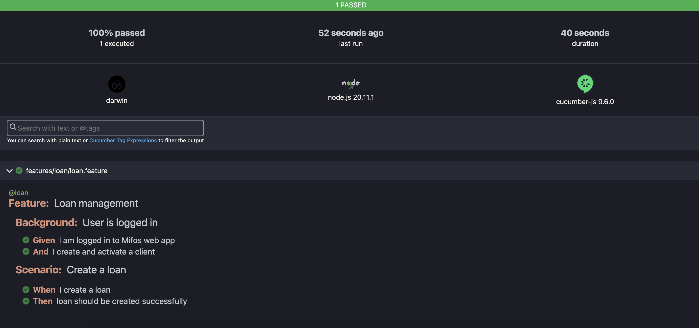

# playwright-api-ui-demo-symphony

Playwright is a Node. js library to automate Chromium, Firefox, and WebKit with a single API.

This demo project also uses Cucumber to write tests in Gherkin language.

## Setup

### *Install Node Version Manager*

Node Version Manager can manage node versions

- Install curl and add NVM Node Version Manager

```bash
sudo apt-get install curl && curl -o- https://raw.githubusercontent.com/nvm-sh/nvm/v0.39.1/install.sh | bash 
```

- Install NodeJS Version 18.15.0 or higher

```bash
nvm install 18.15.0
nvm use 18.15.0 
```

### *Install yarn globally*

```bash
npm install -g yarn 
```

### *Install framework packages*

```bash
yarn install
```

## Run test

### Run the test locally

Run the following command to download & install the browsers first: `npx playwright install`

Follow the steps below to run the tests on your local

- Run only UI test

  ```bash
  ENVIRONMENT=demo npm run test:demo:ui
  ```


### View Test Result

After test run a html report (html-report.html) is generated and stored in the reports folder.
Download the file and view it in your browser.


